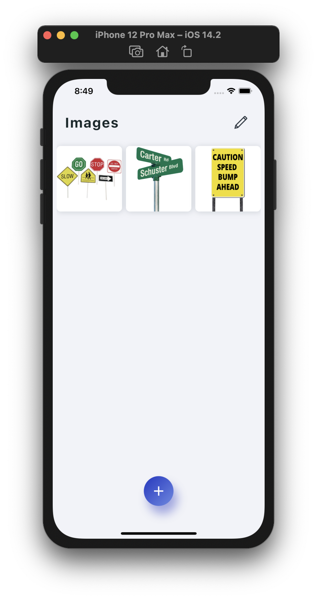

# vc_cam
-Brian MacPherson

  
    
    

-How to run locally

    -First you must setup a Flutter development envireonment by following the steps in the link below. 
    
        NOTE: In order to mimic my exact version, download the "1.22.3" version of flutter from here - https://flutter.dev/docs/development/tools/sdk/releases , then continue with the steps)

        Installation steps - https://flutter.dev/docs/get-started/install
     
    -Run "flutter doctor" in the terminal to ensure that everything required is installed properly
    -(Optional) Add/Install flutter plugin with VS Code if you wish to see the code in a neatly formatted manner
    -Clone repository locally and cd into it's root folder
    -In the terminal, run "flutter run". If you already have a simulator open, it will open there. If you have a real phone plugged in, it will open on your real phone. If running on a real device, I suggest running "flutter run --release" so that the app will remain on the phone even after unplugging.

-Known bugs

    -Adding a new text box to an image only currently displays properly in iOS simulator.

-What is the process to deploy/release the mobile app to the Google Play or Apple Store? 

    ANDROID
    https://flutter.dev/docs/deployment/android
    -Add Icons and splash screens
    -Sign the app by creating a keystore
    -Add key properties file
    -Add key file to gitignore
    -Configure signing in build gradle
    -Run flutter build app bundle
    -Log into Google play console
    -Create application and go through steps
    -Create a release in the application and upload bundled project

    IOS
    https://flutter.dev/docs/deployment/ios
    -Add Icons and splash screens
    -Log into App store connect
    -Register new app ID
    -Add app in App Store Connect and go through steps
    -Open Runner folder in Xcode and set app name and other build details
    -Run Flutter build ios
    -Run Product > Archive
    -Click on app in pop up and press publish

-How would you manage back-end synchronization/versioning in response to Android or iOS updates?

    There a couple ways we could manage versioning, depending on the desired outcome. 
    
    -If we always want the user to have the latest version and nothing less, then we can check check if there is a more up to date version in the app/play store upon launching the app. If there is a newer version available, then the user can be prompted to update the app in order to proceed using the app. 

    -If the concern is whether or not the app will continue to work with updates to a backend api, then a minimum compatible version could be stored on the server. You could then send a get request upon launching the app to see if that particular version can continue to be used.

    There are other possible ways to maintain synchronization depending on the desired effect.

